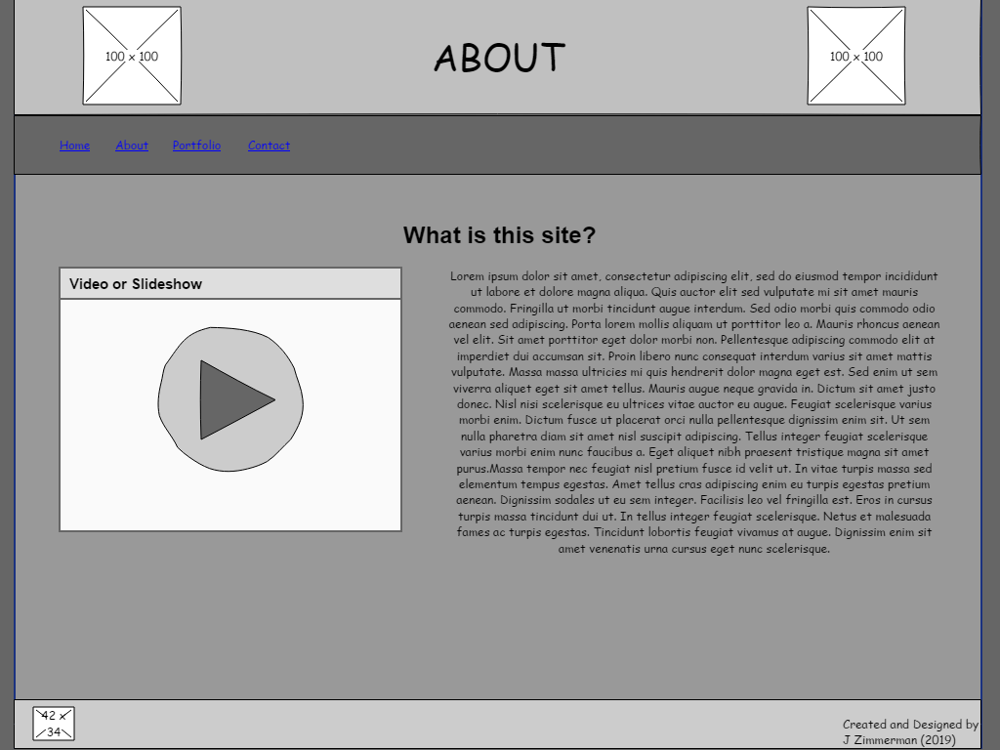

# Zimmerman 7420 Project

I intend to turn this webpage into an online portfolio which I can change to fit my needs as time goes on.  As an aspiring writer, this is something I've needed for many years and just put off.  Hopefully I will be able to craft something that can be submitted as an e-portfolio for graduation and as a showcase of my work for potential jobs or publishing post graduation.

## Wireframes

Included in this section are Wireframes of potential designs for the finished project. I have considered creating dropdown menus for navigation as well as a few types of multimedia to display for the portfolio.  These features will change as the semester moves forward and I figure out my coding limitations.

This page is the homepage of the site.  It includes a header with Images and the page name as well as navigation hyperlinks.  The body of the page includes a short explanatory text as well as an image or a slideshow.  The footer will include the site icon and some copyright data.

This page will offer users more detailed information about the site and it's purpose. It includes a header with Images and the page name as well as navigation hyperlinks.  The body of the page includes a short explanatory text as well as a video or a slideshow.  The footer will include the site icon and some copyright data.

This page houses the main body of work I wish to display. It includes a header with Images and the page name as well as navigation hyperlinks.  The body of the page includes images of selected work (or perhaps a slideshow of poetry or short fiction) as well as hyperlinks to download or view other works and an explanatory text section.  The footer will include the site icon and some copyright data.

This page will serve the purpose of connecting me with potential employers and other interested parties. It includes a header with Images and the page name as well as navigation hyperlinks.  The body of the page includes a list of my personal contact information, a calendar which will provide any information on relevant events I may be attending, and an email widget included to let people send an email without leaving the page.  The footer will include the site icon and some copyright data.
